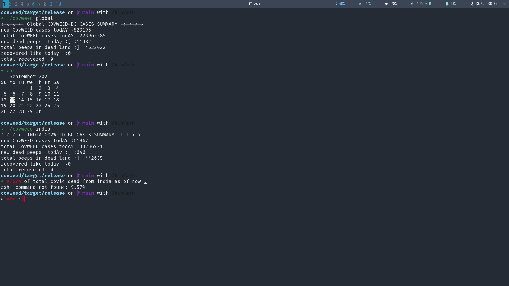

<h1 align="center">COVWeeD</h1>


## To use :
### 1.) Clone the repo and build in release mode

```bash 
cd covweed && cargo build --release
```
### 2.)Add to path 
```bash
cp target/release/covweed  ~/.local/bin/covweed
```
### 3.)Run the executable , make sure to have cargo v1.54+

* For Global
```bash  
covweed global  
```
* For Specific country
```bash
covweed india
```

### As of 13/09/21 

9.57% of all deaths from India



<h3 align="center"> PLEASE , it isN't that gooD<h3>
<p align="center">

</p>


